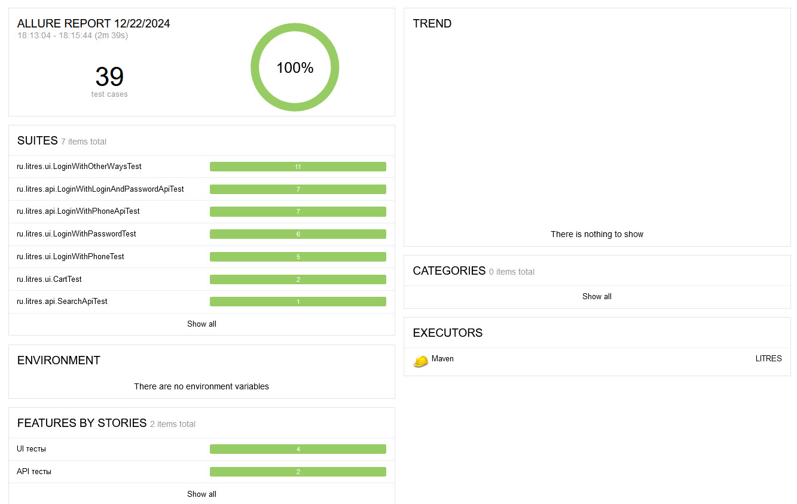
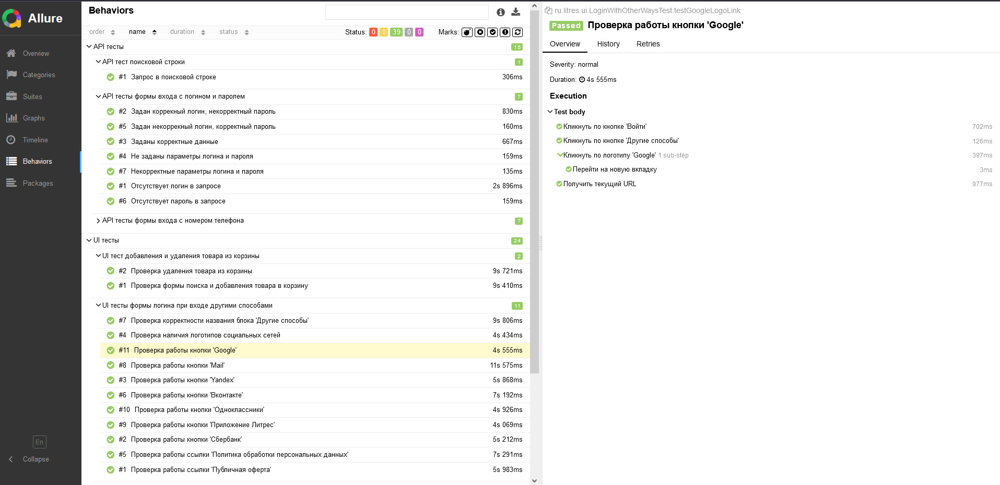
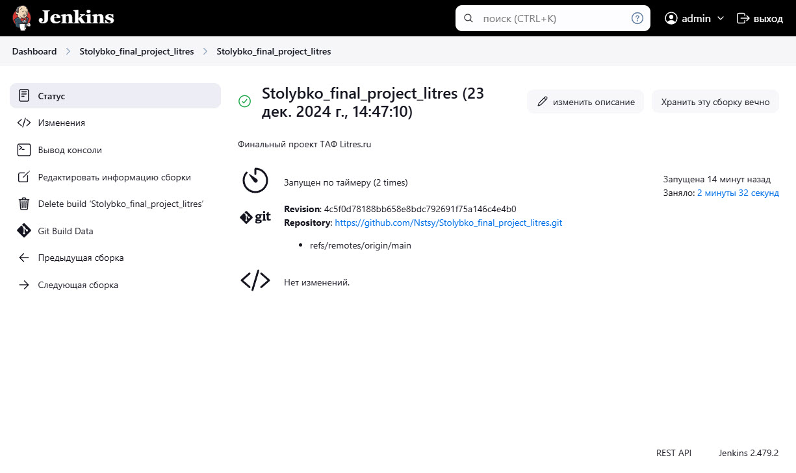

Столыбко Анастасия-Олимпия Андреевна\
+375-29-230-90-10\
nstsy@yandex.ru

# Тестовый автоматизированный фреймворк для сайта [Litres](https://litres.com)

## Структура проекта
### 1. src/main/java/ru.litres - содержит основной код страниц веб-приложения и утилитарные классы.
Пакет **`api`**: 
- пакет `endpoints` c классом *Endpoints* Определяет базовый URL и различные конечные точки API для аутентификации и поиска
- *LoginApi*: Выполняет запросы на вход в систему с логином и паролем.
- *PhoneApi*: Выполняет запросы на вход в систему с номером телефона и страной.
- *SearchApi*: Выполняет запросы поиска.\

Пакет **`domain`**:
- *User*: Модель пользователя с его данными.
- *UsersLogin*: Предназначен для генерации различных пользователей с разными комбинациями логинов и паролей.
- *UsersPhone*: Предназначен для генерации различных пользователей с разными комбинациями стран и телефонов.

Пакет **`enums`**:
- *CountryCode*: Перечисления для кодов стран.

Пакет **ui** (классы в проекте реализуют паттерн `Page Object Model`):
- пакет `driver` с классом *Driver*: Управляет взаимодействием с веб-драйвером.
- пакет `steps` с классами *CartAddBookStep*, *LoginPasswordStep*,*LoginWithPhoneStep*
- пакет `pages`:
     - пакет `book` с классами *BookMessages*, *BookPage*, *BookXpath*
     - пакет `home` с классами *HomePage*, *HomeXpath*
     - пакет `login`:\
                       - пакет `login_password` с классами *LoginPasswordMessages, LoginPasswordPage, LoginPasswordXpath*\
                       - пакет `otherways` с классами *OtherwaysMessages, OtherwaysPage, OtherwaysXpath*\
                       - пакет `phone` с классами *PhoneMessages, PhonePage, PhoneXpath*
  
### 2. src/test/java/ru.litres - cодержит тесты, разделенные на логические модули: тестирование API и UI.

   Классы пакета `ru.litres.api`:
   - BaseApiTest (Базовый класс для API-тестов)
   - LoginWithLoginAndPasswordApiTest (API тесты формы входа с логином и паролем)
   - LoginWithPhoneApiTest(API тесты формы входа с номером телефона)
   - SearchApiTest (API тест поисковой строки)
   
   Классы пакета `ru.litres.ui`:
   - BaseUiTest (Базовый класс для UI-тестов)
   - CartTest (UI тесты добавления и удаления товара из корзины)
   - LoginWithOtherWaysTest (UI тесты формы логина при входе другими способами)
   - LoginWithPasswordTest (UI тесты формы логина при входе с логином и паролем)
   - LoginWithPhoneTest (UI тесты формы логина при входе с номером телефона)

## Реализованные проверки
- API тесты авторизации с помощью логина и пароля 
- API тесты авторизации с помощью номера телефона
- API тест поисковой строки
- UI тесты авторизации с помощью логина и пароля
- UI тесты авторизации с помощью номера телефона
- UI тесты авторизации с помощью других способов
- UI тесты добавления и удаления товара из корзины

## Отчет о результатах тестирования в Allure Report
Отчеты формируются с использованием [Allure Report](https://docs.qameta.io/allure/#_report) и позволяют наглядно видеть результаты тестов, их статус и детали.  

## Сборка проекта в Jenkins
